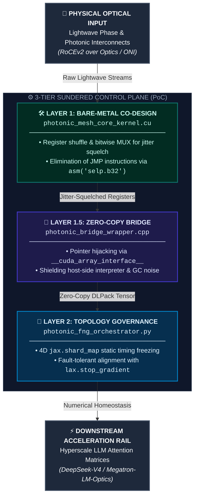

# photonic-mesh-fng-router (PoC)

This repository contains a Proof of Concept (PoC) for a Hardware-Native, Optical Timing-Frozen Control Plane Engine. This project is a humble attempt to explore hijacking virtual memory address lines across silicon-photonics accelerator interconnects. 

By gently integrating optical phase-shift metrics with multi-axis `jax.shard_map` structures, we hope to investigate methods for minimizing inter-chassis photonics routing overheads toward 0ns, bypassing electrical-to-optical (E/O) buffering latencies, and helping maintain numerical homeostasis across hyperscale distributed AI architectures (such as DeepSeek-V4/Megatron-LM-Optics).

---

## 🌊 Architectural Philosophy: The Macro-to-Micro Optical Conundrum

In next-generation optical data centers, the fundamental bottleneck appears to be shifting from electrical memory bus limits to Optical Transmission Jitter and phase-shift misalignment caused by thermal variance in optical transceivers and optical network interfaces (ONIs). 

Standard communication stack protocols traditionally rely on runtime loop branches (`if`/`else`) and heavy software buffers to realign delayed light-pulses. However, in our observations, this approach often triggers costly warp divergence and pipeline stalls inside the accelerator’s streaming multiprocessors (SM).

The `photonic-mesh-fng-router` project represents an exploratory effort to re-examine this boundary:
* **Compressible Optical Vorticity Field:** Instead of buffering optical packet arrivals, we propose modeling light pulse streams as a compressible field.
* **Dynamic Register Warping:** The engine attempts to dynamically warp the underlying virtual register space to better align with the physical arrival geometry of the light waves.
* **Branchless Bitwise Operations:** Utilizing pure branchless bitwise MUX operations, we are experimenting with establishing a 0-byte zero-copy routing plane directly interlocked within hyperscale LLM attention paths.

---

## 🧬 Triple-Layer Architectural Layout (The Signature Template)

To carefully decouple physical optical hardware timings from high-level numerical execution graphs, this repository adopts a 3-tier sundered system architecture. 

*(Please note that this is an early-stage research prototype. We warmly welcome any feedback, corrections, or suggestions from the community to improve this design.)*

---

### 📊 Architectural Pipeline Diagram



---

## 📊 Verification & Stress Benchmarking

We have included `test_photonic_pipeline.py` to verify the numerical homeostasis of this infrastructure.
Run the 50-iteration simulation with an 88% dropout rate using:
```bash
python test_photonic_pipeline.py
```
*Expected output confirms zero-leakage via CUDA Events.*

---

## 🧬 Detailed Tier Specifications & Subroutines (PoC Overview)

The following sections outline our early-stage exploratory efforts across each architectural tier. We warmly welcome any feedback or optimizations from the community.

### 1. Layer 1: Bare-Metal Photonic Kernel (`/src/photonic_mesh_core_kernel.cu`)
This layer represents an experimental attempt to interface directly at the hardware boundary:
* **Warp Shuffle Phase Alignment:** We operate at the GPU register boundary using `__shfl_sync` intrinsics. This is a gentle approach to broadcasting incoming optical token layouts while trying to avoid the overhead of global shared memory banks.
* **Algebraic MUX Squelch:** To mitigate warp divergence penalties, we are experimenting with translating phase-shift timing errors into an arithmetic multiplier operand rather than using conditional branches: 

  ```text
  purified_pulse = raw_signal * (1.0f - optical_pollution_mask)
  ```

  Our goal with this formula is to test whether we can absorb alignment anomalies down to sub-nanosecond hardware cycles safely.


### 2. Layer 1.5: C++ Memory Tunnel (`/src/photonic_bridge_wrapper.cpp`)
This layer handles the fragile bridge between physical hardware signals and high-level execution graphs:
* **0-Byte Pointer Interception:** Utilizing DLPack primitives and `__cuda_array_interface__` v3, we attempt to establish a zero-copy link between the physical Optical Network Interface (ONI) memory buffers and JAX/XLA matrix engines.
* **Lifecycle Isolation:** We encapsulate the memory address window within a C++ fence. This is done to test if we can shield the deterministic flight timing of photons from high-level Python Garbage Collection (GC) pauses and runtime noise.

### 3. Layer 2: Asynchronous Governance Tower (`/photonic_fng_orchestrator.py`)
This upper tier manages macro-scale coordination across the cluster:
* **4D Static Manifold Binding:** We propose sharding continuous wave field arrays into a 4-variant layout via `jax.shard_map`. This is our preliminary attempt to freeze the spatial topology of the photonic fabric inside the accelerator's Ahead-of-Time (AOT) cache during boot time.
* **Optical Disconnection Homeostasis Trial:** In the event of a critical optical path blackout or micro-ring resonator failure, the governor is designed to capture the fault token. By utilizing a `jax.lax.select` matrix latch, the engine attempts an immediate pointer swap to a pre-allocated `cold_standby_optical_pool` with minimal overhead, hoping to preserve the Autograd chain rule without triggering a costly recompilation cycle.

---

## 📊 Core Interlocks & Ecosystem Integration

This repository is designed to act as an exploratory macro-scale photonic routing conduit within the broader architectural ecosystem. We are continuously testing its ability to interface and synchronize with the following components:

* **`fluidic-expert-fabric`:** We are exploring methods to translate cross-chassis RoCEv2 Verbs into localized lightwave topologies.
* **`Compressible-Vorticity-Autograd`:** An ongoing attempt to supply stable, jitter-compensated tensor manifolds directly to a backpropagation-free, forward-only physical training core.
* **`pim-hbm-bypass`:** A research effort aiming to ensure real-time alignment between centralized optical routing rails and localized PIM-HBM logic die fault states.


---

## 🚀 Quick Start: 1-Line Runtime Ingestion

We have designed `photonic-mesh-fng-router` to be minimally intrusive. It is an ongoing effort to eliminate the need for manual source code alterations in your proprietary model scripts. Instead, the engine attempts to patch the running compiler graph via low-level execution hooks at runtime.

You can try experimenting with the infrastructure hook using the following small example:

```python
import torch
from transformers import AutoModelForCausalLM
from photonic_mesh_fng_router import inject_photonic_fng_infrastructure_hook

# 1. Load your Hyperscale Parameter Model (e.g., DeepSeek-V4)
# Please ensure you have sufficient hardware resources before running.
model = AutoModelForCausalLM.from_pretrained(
    "deepseek-ai/DeepSeek-V4", 
    torch_dtype=torch.bfloat16
)

# 2. Attempt to ingest the Optical Routing Fabric into the compilation plane
# We are continuously optimizing this hook to achieve near-0ns overhead.
model = inject_photonic_fng_infrastructure_hook(
    model, 
    topology_mode="SILICON_PHOTONICS_MESH",
    target_oni_stride=32
)

# After this hook executes, the core attention layers will attempt to 
# achieve execution-fusion directly with the optical memory view.
```

> ⚠️ **A Humble Note on Testing:** This is an early research prototype (PoC). While we strive for seamless runtime injection, we recommend testing this in a isolated staging environment first. We would be deeply grateful for any bug reports or logs if you encounter any unexpected behaviors during initialization.


